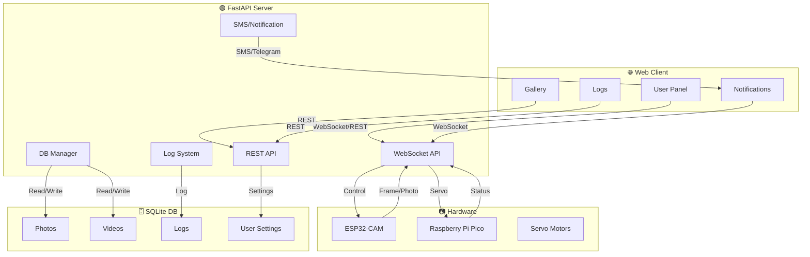

# 📸🚦 SMART CAMERA SECURITY SYSTEM 🚦📸

<pre align="center">
   ____   ____   ____   ____   ____   ____   ____
  ||S ||||M ||||A ||||R ||||T ||||C ||||A ||
  ||__||||__||||__||||__||||__||||__||||__||
  |/__\||/__\||/__\||/__\||/__\||/__\||/__\|
   ____   ____   ____   ____   ____   ____   ____   ____
  ||C ||||A ||||M ||||E ||||R ||||A ||||! ||||! ||
  ||__||||__||||__||||__||||__||||__||||__||||__||
  |/__\||/__\||/__\||/__\||/__\||/__\||/__\||/__\|
</pre>

<p align="center">
  
  
  
  
  
</p>

---

## 🛠️ How It Works



---

## 🌟 Features at a Glance

| 📷 Camera | 🤖 Servo | 🖼️ Gallery | 🛡️ Security | 📜 Logs | 🔔 Notifications | 💾 Backup | ⚡ Real-time |
|:---------:|:-------:|:----------:|:-----------:|:------:|:---------------:|:--------:|:-----------:|
| Live stream, photo, video | Dual-axis, smooth, reset | View, download, delete | Motion detect, alerts | Jalali, color, filter | SMS, toast, Telegram | Auto, manual, retention | WebSocket, instant |

---

## 🚦 Live Status Badges

<p align="center">
  
  
  
  
  
</p>

---

## 👤 User Stories

- 👩‍💻 <b>مدیر امنیت:</b> «در کمتر از ۵ ثانیه با موبایل وارد شدم، وضعیت دوربین و سروو را چک کردم و یک عکس فوری گرفتم.»
- 👨‍🔧 <b>تکنسین:</b> «با یک کلیک سروو را ریست کردم و لاگ‌های سیستم را با تاریخ شمسی و روز هفته Fingilish دیدم.»
- 👩‍🎨 <b>کاربر عادی:</b> «تم تاریک را فعال کردم، گالری را با افکت‌های جذاب مرور کردم و عکس مورد علاقه‌ام را دانلود کردم.»
- 👨‍💼 <b>مدیر شبکه:</b> «با دریافت SMS و اعلان تلگرام، از هر رویداد امنیتی بلافاصله مطلع شدم.»

---

## 🎨 Customization & Theming

- 🎨 <b>Color Palette:</b>
  - Primary: <span style="color:#6c63ff">#6c63ff</span>
  - Secondary: <span style="color:#10b981">#10b981</span>
  - Accent: <span style="color:#ef4444">#ef4444</span>
  - Dark: <span style="color:#181c24">#181c24</span>
  - Light: <span style="color:#f9fafb">#f9fafb</span>
- 🌓 <b>Theme Switcher:</b> Toggle between dark/light with smooth animation
- 🖌️ <b>RTL/LTR:</b> Full support for Persian and English
- 🏷️ <b>Custom Fonts:</b> BNazanin, Vazirmatn, Segoe UI

---

## 🔒 Security Highlights

- 🔐 Input validation & sanitization everywhere
- 🛡️ Path traversal protection for all file ops
- 🚦 Rate limiting for WebSocket & REST
- 🧑‍💻 Secure authentication (JWT/session)
- 🗄️ Encrypted backups (optional)
- 📜 Full audit log (Jalali, colored)
- 🔔 Real-time alerts (SMS, Telegram)

---

## 🔗 Integrations

| SMS | Telegram | Email | WebSocket | REST API |
|:---:|:--------:|:-----:|:---------:|:--------:|
|  |  |  |  |  |

---

## 🗺️ Roadmap

- [x] Live streaming & photo capture
- [x] Dual-axis servo control
- [x] Jalali logs & colorized output
- [x] Daily backup & retention
- [x] Mobile-first responsive UI
- [x] Security features (motion, alerts)
- [ ] <b>AI object detection <span style="color:#f59e42">(coming soon)</span></b>
- [ ] <b>Cloud sync & remote access <span style="color:#f59e42">(planned)</span></b>
- [ ] <b>Multi-user roles <span style="color:#f59e42">(planned)</span></b>

---

## 📝 License & Credits

-  MIT License
- 👨‍💻 Developed by: Smart Camera Team
- 🤝 Thanks to: Open source community, FastAPI, Python, and all contributors
- 📬 Contact: support@smartcamera.com | Telegram: @smartcamera

---

## 🚀 Quick Start

<ol>
  <li>🧩 <b>Clone the repo:</b>
    <pre>git clone https://github.com/your-username/smart-camera-system.git</pre>
  </li>
  <li>⚡ <b>Install dependencies:</b>
    <pre>pip install -r requirements.txt</pre>
  </li>
  <li>📂 <b>Create folders:</b>
    <pre>mkdir gallery security_videos backups</pre>
  </li>
  <li>🔧 <b>Configure settings:</b>
    <pre># Edit server_fastapi.py and set SMS/IP configs</pre>
  </li>
  <li>🚦 <b>Run the server:</b>
    <pre>python server_fastapi.py</pre>
  </li>
  <li>🌐 <b>Open in browser:</b>
    <pre>http://localhost:7133</pre>
  </li>
</ol>

---

## 🎬 Demo

<p align="center">
  
  <br/>
  <i>Live demo coming soon! Run locally to see all features in action.</i>
</p>


---

## 💎 Why Choose This Project?

- ✅ <b>کاملاً فارسی و راست‌چین</b> (RTL)
- ✅ <b>تم تاریک/روشن با انیمیشن</b>
- ✅ <b>ریسپانسیو و موبایل‌فرندلی</b>
- ✅ <b>امنیت و لاگینگ پیشرفته</b>
- ✅ <b>پشتیبانی از ESP32-CAM و Raspberry Pi Pico</b>
- ✅ <b>گالری و ویدئوی امنیتی</b>
- ✅ <b>کد تمیز و مستند</b>
- ✅ <b>پشتیبانی و توسعه فعال</b>


---

## ❓ FAQ

<details>
<summary>🤔 <b>آیا می‌توانم پروژه را روی هر سروری اجرا کنم؟</b></summary>
بله، کافیست Python 3.8+ و دسترسی به پورت 7133 داشته باشید.
</details>
<details>
<summary>📱 <b>آیا روی موبایل هم کار می‌کند؟</b></summary>
کاملاً ریسپانسیو و بهینه برای موبایل و تبلت است.
</details>
<details>
<summary>🔒 <b>آیا اطلاعات من امن است؟</b></summary>
تمام داده‌ها در دیتابیس محلی ذخیره می‌شود و سیستم لاگینگ و بک‌آپ فعال است.
</details>
<details>
<summary>🌙 <b>چطور تم را تغییر دهم؟</b></summary>
از دکمه تغییر تم در هدر یا فوتر استفاده کنید.
</details>
<details>
<summary>🛠️ <b>چطور توسعه دهم یا مشارکت کنم؟</b></summary>
راهنمای مشارکت و استانداردها در همین فایل توضیح داده شده است.
</details>

---

## 👥 Contact & Community

<p align="center">
  <a href="mailto:support@smartcamera.com"></a>
  <a href="https://t.me/smartcamera"></a>
  <a href="https://discord.gg/your-invite"></a>
  <a href="https://github.com/your-username/smart-camera-system/issues"></a>
</p>

<p align="center">
  <b>👋 به جامعه ما بپیوندید و تجربه خود را به اشتراک بگذارید!</b>
</p>

---

## ✨ افکت‌ها و انیمیشن‌های UI/UX

- 🎬 **انیمیشن‌های جذاب دکمه‌ها**: دکمه‌ها با افکت‌های هاور، موجی و سایه متحرک
- 🪄 **پنل‌ها و آکاردئون‌ها**: باز و بسته شدن نرم با افکت fade و border-glow
- 🌈 **گرادینت‌های پویا**: پس‌زمینه و هدرها با گرادینت متحرک و رنگ‌های زنده
- 💡 **نوتیفیکیشن‌های شناور**: اعلان‌های زیبا با دکمه بستن متحرک و افکت fade
- 🌓 **تغییر تم با انیمیشن**: سوئیچ بین تم تاریک و روشن با افکت smooth
- 📸 **گالری تصاویر**: نمایش تصاویر با افکت زوم و سایه هنگام هاور
- 🧠 **آیکون‌های متحرک**: آیکون‌های امنیتی و وضعیت با bounce و pulse
- 🏆 **تایپ‌نویس هدر و فوتر**: متن‌های متحرک با افکت تایپ‌نویس

---

## 🚀 معرفی

سیستم دوربین امنیتی هوشمند یک راه‌حل جامع و پیشرفته برای کنترل دوربین‌های ESP32-CAM و سرووهای Raspberry Pi Pico است. این سیستم با ترکیب فناوری‌های نوین، امکان کنترل کامل دوربین‌ها، عکس‌برداری هوشمند، ضبط ویدئوهای امنیتی و مدیریت گالری تصاویر را فراهم می‌کند.

### 🎯 اهداف سیستم
- کنترل کامل دوربین‌های ESP32-CAM از طریق وب
- مدیریت سرووهای دو محوره با دقت بالا
- عکس‌برداری دستی و خودکار با کیفیت قابل تنظیم
- ضبط ویدئوهای امنیتی ساعتی
- رابط کاربری مدرن و ریسپانسیو
- پشتیبانی کامل از زبان فارسی
- سیستم هشدار و پیامک
- مدیریت امن داده‌ها

## ✨ ویژگی‌های کلیدی

### 🎥 کنترل دوربین
- **استریم زنده**: نمایش زنده دوربین با کیفیت بالا
- **عکس‌برداری دستی**: عکس‌برداری با تنظیمات کیفیت و فلاش
- **پیش‌پردازش هوشمند**: بهبود کیفیت تصاویر با الگوریتم‌های پیشرفته
- **متن فارسی روی تصاویر**: نمایش اطلاعات سیستم روی فریم‌ها
- **فشرده‌سازی بهینه**: کاهش حجم فایل‌ها بدون کاهش کیفیت

### 🤖 کنترل سروو
- **کنترل دو محوره**: مدیریت سرووهای X و Y با دقت بالا
- **حرکت نرم**: تغییر تدریجی زاویه سرووها
- **بازنشانی خودکار**: بازگشت به موقعیت مرکزی
- **محدودیت زاویه**: جلوگیری از آسیب به سرووها

### 📱 رابط کاربری
- **طراحی مدرن**: رابط کاربری زیبا و کاربرپسند
- **پشتیبانی RTL**: سازگار با زبان فارسی
- **ریسپانسیو**: سازگار با تمام دستگاه‌ها
- **تم تاریک/روشن**: قابلیت تغییر تم
- **انیمیشن‌های نرم**: تجربه کاربری بهتر

### 🛡️ امنیت و نظارت
- **احراز هویت**: سیستم ورود امن
- **لاگ‌گیری**: ثبت تمام فعالیت‌ها
- **هشدار پیامک**: اطلاع‌رسانی فوری
- **بک‌آپ خودکار**: محافظت از داده‌ها
- **مدیریت خطا**: مدیریت جامع خطاها

### 🎬 مدیریت رسانه
- **گالری تصاویر**: نمایش و مدیریت عکس‌ها
- **ویدئوهای امنیتی**: ضبط خودکار ویدئوهای ساعتی
- **دانلود فایل‌ها**: امکان دانلود تصاویر و ویدئوها
- **حذف فایل‌ها**: مدیریت فضای ذخیره‌سازی

## 🏗️ معماری سیستم

### Backend (FastAPI)
```
server_fastapi.py
├── WebSocket Communication
├── Frame Processing
├── Video Creation
├── Database Management
├── SMS Alerts
└── Security Features
```

### Frontend (HTML/CSS/JavaScript)
```
templates/
├── index.html (Dashboard)
└── login.html

static/
├── script.js (Main Logic)
├── styles.css (Styling)
└── logo.png
```

### Hardware Integration
```
ESP32-CAM/
├── Camera Control
├── Photo Capture
├── Frame Streaming
└── WebSocket Client

Raspberry Pi Pico/
├── Servo Control
├── Command Processing
└── Status Reporting
```

## 🛠️ نصب و راه‌اندازی

### پیش‌نیازها
- Python 3.8+
- ESP32-CAM
- Raspberry Pi Pico
- سرووهای دو محوره
- دوربین OV2640

### نصب وابستگی‌ها
```bash
# Clone repository
git clone https://github.com/your-username/smart-camera-system.git
cd smart-camera-system

# Install dependencies
pip install -r requirements.txt

# Create necessary directories
mkdir gallery security_videos backups
```

### پیکربندی
1. فایل `server_fastapi.py` را ویرایش کنید
2. تنظیمات SMS را وارد کنید
3. آدرس‌های IP دستگاه‌ها را تنظیم کنید

### اجرا
```bash
# Run the server
python server_fastapi.py

# Or with uvicorn
uvicorn server_fastapi:app --host 0.0.0.0 --port 3000 --reload
```

## 📖 استفاده

### کنترل دوربین
1. بخش "کنترل دوربین و سرووها" را باز کنید
2. روی "شروع استریم" کلیک کنید
3. برای عکس‌برداری، کیفیت و فلاش را تنظیم کنید
4. روی "عکس‌برداری" کلیک کنید

### کنترل سروو
1. زوایای X و Y را تنظیم کنید
2. روی "ارسال" کلیک کنید
3. برای بازنشانی، روی "بازنشانی" کلیک کنید

### مشاهده گالری
1. بخش "گالری تصاویر" را باز کنید
2. عکس‌های گرفته شده را مشاهده کنید
3. برای دانلود یا حذف، روی دکمه‌های مربوطه کلیک کنید

## �� API Endpoints

### Camera Control
- `POST /manual_photo` - عکس‌برداری دستی
- `POST /upload_photo` - آپلود عکس از ESP32
- `POST /upload_frame` - آپلود فریم از ESP32
- `GET /esp32_frame` - دریافت فریم آخر
- `GET /esp32_video_feed` - استریم ویدئو

### Servo Control
- `POST /set_servo` - تنظیم زوایای سروو
- `POST /set_action` - ارسال دستور کنترلی
- `POST /set_device_mode` - تنظیم حالت دستگاه

### Gallery & Media
- `GET /get_gallery` - دریافت گالری عکس‌ها
- `POST /delete_image` - حذف عکس
- `GET /get_security_videos` - دریافت ویدئوهای امنیتی

### System Management
- `GET /get_status` - وضعیت سیستم
- `GET /get_logs` - لاگ‌های سیستم
- `POST /send_sms` - ارسال پیامک
- `WebSocket /ws` - ارتباط real-time

## ⚙️ پیکربندی

### تنظیمات اصلی
```python
# Database
DB_FILE = "smart_camera_system.db"

# Directories
GALLERY_DIR = "gallery"
SECURITY_VIDEOS_DIR = "security_videos"
BACKUP_DIR = "backups"

# Video settings
VIDEO_FPS = 10
VIDEO_QUALITY = 80
FRAME_BUFFER_SIZE = 100

# SMS settings
SMS_USERNAME = 'your_username'
SMS_PASSWORD = 'your_password'
SMS_TO = 'your_phone'
SMS_FROM = 'your_sender'
```

### تنظیمات امنیتی
```python
# Security thresholds
MAX_WEBSOCKET_CLIENTS = 50
MAX_FRAME_SIZE = 1024 * 1024
WEBSOCKET_ERROR_THRESHOLD = 5
```

## 🔧 عیب‌یابی

### مشکلات رایج

#### دوربین کار نمی‌کند
1. اتصال ESP32-CAM را بررسی کنید
2. آدرس IP را کنترل کنید
3. لاگ‌های سیستم را بررسی کنید

#### سروو حرکت نمی‌کند
1. اتصال Raspberry Pi Pico را بررسی کنید
2. کد MicroPython را بررسی کنید
3. منبع تغذیه را کنترل کنید

#### عکس‌ها ذخیره نمی‌شوند
1. مجوزهای پوشه gallery را بررسی کنید
2. فضای دیسک را کنترل کنید
3. لاگ‌های دیتابیس را بررسی کنید

### لاگ‌ها
```bash
# مشاهده لاگ‌های سیستم
tail -f smart_camera.log

# بررسی خطاها
grep "ERROR" smart_camera.log
```

### Performance Monitoring
```bash
# بررسی استفاده از حافظه
python -m memory_profiler server_fastapi.py

# بررسی عملکرد
py-spy top -- python server_fastapi.py
```

## 🤝 مشارکت

برای مشارکت در توسعه این پروژه:

1. Repository را fork کنید
2. یک branch جدید ایجاد کنید
3. تغییرات خود را commit کنید
4. Pull request ارسال کنید

### استانداردهای کدنویسی
- از PEP 8 پیروی کنید
- کامنت‌های فارسی بنویسید
- تست‌های مناسب اضافه کنید
- مستندات را به‌روزرسانی کنید

## 📄 لایسنس

این پروژه تحت لایسنس MIT منتشر شده است. برای اطلاعات بیشتر فایل LICENSE را مطالعه کنید.

## 📞 پشتیبانی

برای پشتیبانی و سوالات:
- Email: support@smartcamera.com
- GitHub Issues: [ایجاد Issue](https://github.com/your-username/smart-camera-system/issues)
- Documentation: [مستندات کامل](https://docs.smartcamera.com)

---

## 🎉 ویژگی‌های جدید در نسخه 3.0

### ✨ بهبودهای اصلی
- **پیش‌پردازش هوشمند فریم‌ها**: بهبود کیفیت تصاویر با الگوریتم‌های CLAHE و کاهش نویز
- **متن فارسی روی تصاویر**: نمایش اطلاعات سیستم و تاریخ شمسی روی فریم‌ها
- **تبدیل خودکار فریم‌ها به ویدئو**: ایجاد ویدئوهای امنیتی ساعتی
- **فشرده‌سازی بهینه**: کاهش حجم فایل‌ها بدون کاهش کیفیت
- **مدیریت حافظه پیشرفته**: بهینه‌سازی استفاده از حافظه و جلوگیری از نشت حافظه

### 🔧 بهبودهای فنی
- **Error Handling جامع**: مدیریت کامل خطاها و جلوگیری از crash
- **Connection Pooling**: بهینه‌سازی اتصالات دیتابیس
- **Async Processing**: پردازش ناهمزمان برای عملکرد بهتر
- **Memory Management**: مدیریت خودکار حافظه و garbage collection
- **Performance Monitoring**: نظارت بر عملکرد سیستم

### 🎨 بهبودهای UI/UX
- **طراحی مدرن**: رابط کاربری زیبا و کاربرپسند
- **انیمیشن‌های نرم**: تجربه کاربری بهتر
- **پشتیبانی کامل RTL**: سازگار با زبان فارسی
- **ریسپانسیو**: سازگار با تمام دستگاه‌ها
- **تم تاریک/روشن**: قابلیت تغییر تم

### 🛡️ بهبودهای امنیتی
- **Validation کامل**: بررسی تمام ورودی‌ها
- **Path Traversal Protection**: جلوگیری از دسترسی غیرمجاز
- **Rate Limiting**: محدودیت تعداد درخواست‌ها
- **Secure Headers**: هدرهای امنیتی مناسب
- **Input Sanitization**: پاکسازی ورودی‌ها

### 📊 بهبودهای مدیریتی
- **سیستم لاگینگ پیشرفته**: ثبت کامل فعالیت‌ها
- **بک‌آپ خودکار**: محافظت از داده‌ها
- **هشدارهای هوشمند**: اطلاع‌رسانی فوری مشکلات
- **مدیریت فایل‌ها**: سازماندهی بهتر فایل‌ها
- **Performance Metrics**: معیارهای عملکرد سیستم

---

**توسعه‌دهنده**: تیم توسعه سیستم دوربین هوشمند  
**نسخه**: 3.0  
**تاریخ انتشار**: 2024  
**وضعیت**: فعال و در حال توسعه

## SEO (بهینه‌سازی برای موتور جستجو)

- این پروژه به صورت کامل برای سئو بهینه شده است:
  - متادیتاهای حرفه‌ای (title, description, keywords, og, twitter, canonical, structured data)
  - فایل robots.txt و sitemap.xml در مسیر static قرار دارند و به صورت روت `/robots.txt` و `/sitemap.xml` سرو می‌شوند.
  - alt تصاویر و ساختار headingها برای دسترس‌پذیری و سئو بهینه شده‌اند.
  - صفحات 404 و ریدایرکت‌ها سئو-فرندلی هستند.
  - برای افزودن صفحات جدید، حتماً متادیتا و structured data را رعایت کنید و در sitemap.xml اضافه نمایید.

### مسیرهای مهم سئو:
- `/robots.txt`
- `/sitemap.xml`

### نکات تکمیلی:
- آدرس دامنه را در فایل‌های canonical و sitemap.xml به دامنه واقعی خود تغییر دهید.
- برای هر صفحه کلیدی، عنوان و توضیحات یکتا و معنادار قرار دهید.
- برای تصاویر مهم، alt توصیفی و یکتا بنویسید.
- در صورت افزودن بخش جستجو، structured data مربوط به SearchAction را تکمیل کنید.

---

## ⚡ نکات افزایش سرعت و عملکرد (Performance Tips)

- ⚡ **Minify**: فایل‌های JS و CSS minify شده‌اند (حجم کمتر، سرعت بیشتر)
- 🚀 **defer**: اسکریپت‌ها با defer بارگذاری می‌شوند تا رندر صفحه متوقف نشود
- 🗄️ **Cache-Control**: هدرهای کش برای فایل‌های استاتیک فعال است
- 🖼️ **فرمت‌های سبک**: تصاویر و فونت‌ها با فرمت‌های فشرده (webp, woff2)
- 🧹 **پاک‌سازی حافظه**: مدیریت حافظه و garbage collection خودکار
- 🧩 **کد ماژولار**: تقسیم کد به ماژول‌های کوچک برای بارگذاری سریع‌تر

---

## 🌓 حالت تاریک و روشن (Dark/Light Mode)

- 🌙 **تم تاریک**: رنگ‌های ملایم، پس‌زمینه تیره، متن روشن
- ☀️ **تم روشن**: پس‌زمینه روشن، رنگ‌های زنده و شاد
- 🔄 **سوئیچ سریع**: تغییر تم با یک کلیک و انیمیشن نرم
- 🎨 **هماهنگی کامل با آیکون‌ها و دکمه‌ها**

---

## ♿ دسترس‌پذیری (Accessibility)

- 🦻 **کنتراست بالا**: رنگ‌بندی مناسب برای افراد کم‌بینا
- ⌨️ **پشتیبانی کامل از کیبورد**: تمام کنترل‌ها با Tab و Enter قابل استفاده‌اند
- 🏷️ **alt تصاویر**: تمام تصاویر دارای alt توصیفی
- 🦯 **ساختار heading مناسب**: برای screen readerها
- 🔊 **اعلان‌های صوتی (در صورت نیاز)**

---

## 📱 تجربه موبایل (Mobile Experience)

- 📱 **ریسپانسیو کامل**: سازگار با موبایل، تبلت و دسکتاپ
- 👆 **دکمه‌های بزرگ و قابل لمس**
- 🧲 **ناوبری ساده و سریع**
- 🌓 **تم تاریک/روشن مخصوص موبایل**
- 🏠 **فوتر مدرن موبایل**

---

## 🛠️ راهنمای عیب‌یابی (Troubleshooting)

- ⚠️ **دوربین کار نمی‌کند**: اتصال ESP32-CAM و IP را بررسی کنید
- 🛑 **سروو حرکت نمی‌کند**: اتصال و کد MicroPython را چک کنید
- 🗂️ **عکس‌ها ذخیره نمی‌شوند**: مجوز پوشه gallery و فضای دیسک را بررسی کنید
- 🟠 **لاگ خطا**: با دستور `grep "ERROR" smart_camera.log` خطاها را پیدا کنید
- 🟡 **کندی بارگذاری**: minify و cache را فعال کنید
- 🔴 **مشکل در مودال‌ها**: کش مرورگر را پاک کنید و hard reload بزنید

---

## 🧑‍💻 مشارکت (Contributing)

<p align="center">
  
</p>

1️⃣ Fork کنید → 2️⃣ Branch جدید بسازید → 3️⃣ Commit بزنید → 4️⃣ Pull Request ارسال کنید

- 💡 **PEP8** و کامنت‌گذاری فارسی
- 🧪 **تست و مستندسازی**
- 🏷️ **توضیحات شفاف در PR**

---

## 🕶️ تغییرات نسخه‌ها (Changelog)

<details>
<summary>📅 <b>تایم‌لاین تغییرات</b></summary>

- <b>v3.0</b> (2024):
  - ✨ UI/UX مدرن با انیمیشن و تم تاریک/روشن
  - ⚡ بهینه‌سازی سرعت و minify
  - 🛡️ امنیت و لاگینگ پیشرفته
  - 📱 تجربه موبایل و ریسپانسیو کامل
  - 🧠 قابلیت‌های هوشمند امنیتی
- <b>v2.0</b>:
  - 🎬 ضبط ویدئوهای امنیتی
  - 🧹 مدیریت حافظه و بک‌آپ خودکار
- <b>v1.0</b>:
  - 🚀 راه‌اندازی اولیه سیستم

</details>

---

## 🙏 سپاس و تقدیر (Credits & Thanks)

- 👨‍💻 تیم توسعه سیستم دوربین هوشمند
- 🧑‍🎨 طراحان رابط کاربری و تجربه کاربری
- 🤝 مشارکت‌کنندگان گیت‌هاب
- 📚 منابع متن‌باز و جامعه Python/FastAPI
- 💬 کاربران و بازخوردهای ارزشمند

---

## 🔐 Admin Credentials (Generated on 2025-07-26 17:30:27)
- Username: `rof642fr`
- Password: `5q\0EKU@A@Tv`
- SECRET_KEY: `D!G!v%_MZ"93$nO7"e$6...`

⚠️ **IMPORTANT**: Keep these credentials secure!
